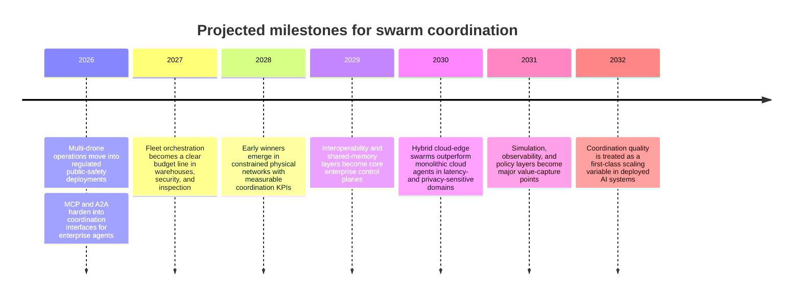

  

  <article>
    
    <h3>Anthropic MCP</h3>
    
Protocol infrastructure for connecting agents, tools, and data.

  </article>
  <article>
    
    <h3>Google A2A</h3>
    
Agent-to-agent coordination across enterprise systems and frameworks.

  </article>
  <article>
    
    <h3>NVIDIA Physical AI</h3>
    
Simulation, edge compute, and robotics tooling for embodied systems.

  </article>

# The Next AI Scaling Law Will Lie in Swarm Coordination

## A new horizon

My thesis is simple: the next major performance curve in applied AI will come less from making one model larger and more from getting many heterogeneous agents to coordinate under real-world constraints. This is not a claim that decentralization replaces centralization; the more appropriately possible future is hybrid and hierarchical, with cloud models handling global planning while edge agents, robots, and local runtimes handle execution, sensing, and recovery. ([Google Research, Jan. 2026](https://research.google/blog/towards-a-science-of-scaling-agent-systems-when-and-why-agent-systems-work/); [Chen et al., ICRA 2024](https://yongchao98.github.io/MIT-REALM-Multi-Robot/); [comparative multi-robot study, Feb. 2025](https://doi.org/10.3390/s25051353).)

## Concept stack for investors

  <article>01<h3>Agent</h3>
A model-backed worker that can reason, call tools, observe state, and take bounded actions.
</article>
  <article>02<h3>Swarm coordination</h3>
The operating layer that lets many agents divide work, share context, avoid collisions, and recover from failure.
</article>
  <article>03<h3>Hybrid cloud-edge</h3>
Cloud models plan globally; local agents execute close to sensors, robots, data, and latency constraints.
</article>
  <article>04<h3>Control point</h3>
The investable choke point is not only the model. It is scheduling, memory, policy, observability, and simulation.
</article>

Investor translation: if single-model scaling asks "which model is smartest?", coordination scaling asks "which system makes many imperfect agents reliable together?"

## Early signals

Bigger models are no longer the only way to scale intelligence.

The next AI scaling law will definitely sit above the model layer, in coordination. As AI moves from chat into warehouses, vehicles, enterprise workflows, and autonomous machines, system performance will increasingly depend on how well many agents share context, allocate tasks, communicate, and recover from failure. The evidence does not support a maximalist story in which decentralization replaces centralization. It supports a more practical one: hybrid systems win when they combine centralized planning with distributed execution, especially on tasks that are parallelizable, latency-sensitive, or physically embodied. ([Google Research, Jan. 2026](https://research.google/blog/towards-a-science-of-scaling-agent-systems-when-and-why-agent-systems-work/); [Chen et al., ICRA 2024](https://yongchao98.github.io/MIT-REALM-Multi-Robot/); [centralization vs. decentralization study, Feb. 2025](https://doi.org/10.3390/s25051353).)

The first deployed signal is Amazon’s warehouse network. In June 2025, Amazon said it had deployed more than 1 million robots and introduced DeepFleet, a generative AI foundation model designed to coordinate robot traffic across fulfillment centers. Amazon’s own claim is not that each robot suddenly became radically more capable, but that coordination improved fleet travel time by 10 percent. That is a textbook scaling signal: system-level gains emerging from orchestration across a large installed base. ([Amazon, Jun. 2025](https://www.aboutamazon.com/news/operations/amazon-million-robots-ai-foundation-model).)

<figure class="essay-deployment-photo">
  
  <figcaption>Amazon warehouse robotics and DeepFleet coordination layer. Source: <a href="https://www.aboutamazon.com/news/operations/amazon-million-robots-ai-foundation-model">Amazon</a>.</figcaption>
</figure>

The second signal is multi-drone operations moving from demos to regulated deployment. Skydio reported that Las Vegas Metropolitan Police received FAA approval in September 2025 for one remote pilot to oversee up to four Skydio X10 drones simultaneously, with New York Power Authority receiving similar approval in January 2026; by March 2026, Skydio said 12 additional public-safety agencies had approvals under a streamlined FAA process. The important point is not the drone itself. It is the emergence of staff-leveraging, multi-agent control as operational infrastructure. ([Skydio, Mar. 2026](https://www.skydio.com/blog/bvlos-introducing-multi-drone-operations).)

<figure class="essay-deployment-photo">
  
  <figcaption>Skydio dock-based drone operations for public safety, utilities, inspection, and site security. Source: <a href="https://www.skydio.com/blog/bvlos-introducing-multi-drone-operations">Skydio</a>.</figcaption>
</figure>

The third signal is software infrastructure standardizing around agent coordination rather than isolated model calls. Anthropic launched MCP in November 2024 as an open protocol for connecting AI systems to tools and data; by December 2025, it said MCP had more than 10,000 active public servers and had been adopted by products including ChatGPT, Gemini, Microsoft Copilot, and Visual Studio Code. Google then introduced A2A in April 2025 as an open protocol for agents to collaborate across frameworks, and in its 2026 business trends report said Salesforce and Google Cloud were already building cross-platform agents on top of it. Even if the numbers come from vendors and should be treated cautiously, the direction is clear: the market is building a coordination layer. ([Anthropic, Nov. 2024](https://www.anthropic.com/news/model-context-protocol) and [Dec. 2025](https://www.anthropic.com/news/donating-the-model-context-protocol-and-establishing-of-the-agentic-ai-foundation); [Google, Apr. 2025](https://developers.googleblog.com/en/a2a-a-new-era-of-agent-interoperability/) and [Jan. 2026](https://blog.google/innovation-and-ai/infrastructure-and-cloud/google-cloud/ai-business-trends-report-2026/).)

  <article><h3>MCP</h3>
Tool and data connectivity for agents.
</article>
  <article><h3>A2A</h3>
Agent-to-agent coordination across platforms.
</article>
  <article><h3>Edge AI</h3>
Physical-AI runtime near robots and sensors.
</article>

<figure class="essay-deployment-photo">
  
  <figcaption>NVIDIA Jetson Thor physical-AI edge system, representative of the edge runtime layer discussed in the thesis. Source: <a href="https://blogs.nvidia.com/blog/jetson-thor-physical-ai-edge/">NVIDIA</a>.</figcaption>
</figure>

My first projection is that, by 2028, the clearest commercial gains from coordinated intelligence will appear in constrained, repetitive, physical networks such as warehouses, security, utilities inspection, and response operations. The assumption is that these environments have stable maps, measurable KPIs, and repeated tasks, which make coordination quality easier to monetize than open-ended reasoning. This would be falsified if most measurable operational gains over the next two years still come primarily from single-agent model upgrades rather than from fleet schedulers, multi-agent task allocation, or shared-state systems. ([Amazon, Jun. 2025](https://www.aboutamazon.com/news/operations/amazon-million-robots-ai-foundation-model); [Skydio, Mar. 2026](https://www.skydio.com/blog/bvlos-introducing-multi-drone-operations); [Google Research, Jan. 2026](https://research.google/blog/towards-a-science-of-scaling-agent-systems-when-and-why-agent-systems-work/).)

My second projection is that, by 2029 or 2030, agent interoperability will matter as much as model choice inside the enterprise stack. The assumption is that enterprises remain heterogeneous: multiple vendors, multiple models, many tools, and multiple security domains. If that assumption holds, open coordination protocols and shared memory layers become real control points; if one vertically integrated vendor captures the full workflow end to end, this thesis weakens substantially. ([Anthropic, Nov. 2024](https://www.anthropic.com/news/model-context-protocol) and [Dec. 2025](https://www.anthropic.com/news/donating-the-model-context-protocol-and-establishing-of-the-agentic-ai-foundation); [Google, Apr. 2025](https://developers.googleblog.com/en/a2a-a-new-era-of-agent-interoperability/) and [Jan. 2026](https://blog.google/innovation-and-ai/infrastructure-and-cloud/google-cloud/ai-business-trends-report-2026/).)

My third projection is that, by 2030 to 2032, the strongest swarm-like systems will be hybrid cloud-edge architectures, not fully decentralized swarms. Recent work on agent systems found that multi-agent coordination materially improves performance on parallelizable tasks but can hurt on sequential ones, while multi-robot studies found hybrid frameworks often scale better than pure centralized or pure decentralized designs; recent UAV-swarm research likewise points toward onboard agents coordinated with edge or cloud validation. This projection assumes edge hardware and local model runtimes continue improving and that latency, connectivity, privacy, and safety remain binding constraints. It would be falsified if cheap, reliable cloud inference plus ubiquitous connectivity erases the operational advantage of local coordination. ([Google Research, Jan. 2026](https://research.google/blog/towards-a-science-of-scaling-agent-systems-when-and-why-agent-systems-work/); [Chen et al., ICRA 2024](https://yongchao98.github.io/MIT-REALM-Multi-Robot/); [Nguyen et al., Jan. 2026](https://arxiv.org/abs/2601.14437); [NVIDIA, Aug. 2025](https://blogs.nvidia.com/blog/jetson-thor-physical-ai-edge/); [Ollama docs, accessed Jul. 2026](https://docs.ollama.com/api/introduction).)

The investor takeaway is straightforward. Stop asking only which model gets bigger, and start asking who owns scheduling, shared memory, policy enforcement, communication, observability, and simulation across fleets of models, robots, and edge devices. If intelligence is becoming distributed, the value will not accrue only to the best individual agent. It will accrue to the companies that make coordination reliable, safe, and cheap. ([Anthropic, Dec. 2025](https://www.anthropic.com/news/donating-the-model-context-protocol-and-establishing-of-the-agentic-ai-foundation); [Google, Apr. 2025](https://developers.googleblog.com/en/a2a-a-new-era-of-agent-interoperability/); [Amazon, Jun. 2025](https://www.aboutamazon.com/news/operations/amazon-million-robots-ai-foundation-model).)

## Market map

| Bottleneck | Investable Category | Example companies or tech |
|---|---|---|
| Task allocation, routing, and congestion across many moving agents | Fleet orchestration and multi-agent scheduling | Amazon DeepFleet, Skydio multi-drone operations, Anduril Lattice C2 |
| Fragmented context, tools, and agent-to-agent communication | Agent middleware, interoperability, and shared-memory layers | Anthropic MCP, Google A2A, LangGraph and related orchestration stacks |
| Reliability, safety, and failure containment in embodied or high-stakes systems | Simulation, observability, and policy-enforcement layers | NVIDIA Isaac and Jetson stack, Anduril Lattice Mesh, edge-cloud validation layers for UAV swarms |

These examples are already visible either in production systems or in official platform roadmaps: Amazon’s robot coordination layer, Skydio’s multi-drone operational stack, Anthropic’s MCP ecosystem, Google’s A2A protocol, Anduril’s Lattice command-and-control products, and NVIDIA’s physical-AI stack. ([Amazon, Jun. 2025](https://www.aboutamazon.com/news/operations/amazon-million-robots-ai-foundation-model); [Skydio, Mar. 2026](https://www.skydio.com/blog/bvlos-introducing-multi-drone-operations); [Anthropic, Nov. 2024](https://www.anthropic.com/news/model-context-protocol) and [Dec. 2025](https://www.anthropic.com/news/donating-the-model-context-protocol-and-establishing-of-the-agentic-ai-foundation); [Google, Apr. 2025](https://developers.googleblog.com/en/a2a-a-new-era-of-agent-interoperability/); [Anduril product docs, accessed Jul. 2026](https://www.anduril.com/lattice/command-and-control); [NVIDIA, Aug. 2025](https://blogs.nvidia.com/blog/jetson-thor-physical-ai-edge/).)

## Timeline

The timeline is a projection, not a certainty. It is anchored in today’s deployed signals and in current research showing that hybrid coordination architectures can outperform pure centralized or pure decentralized designs in the right task classes. ([Amazon, Jun. 2025](https://www.aboutamazon.com/news/operations/amazon-million-robots-ai-foundation-model); [Skydio, Mar. 2026](https://www.skydio.com/blog/bvlos-introducing-multi-drone-operations); [Google Research, Jan. 2026](https://research.google/blog/towards-a-science-of-scaling-agent-systems-when-and-why-agent-systems-work/); [Chen et al., ICRA 2024](https://yongchao98.github.io/MIT-REALM-Multi-Robot/); [Nguyen et al., Jan. 2026](https://arxiv.org/abs/2601.14437).)

## Sources to read next

The most useful primary source for this thesis has been **Google’s “Towards a Science of Scaling Agent Systems”**, which is the strongest current evidence that more agents help on parallelizable tasks but can hurt on sequential ones. It is the cleanest bridge from intuition to design principle. ([Google Research, Jan. 2026](https://research.google/blog/towards-a-science-of-scaling-agent-systems-when-and-why-agent-systems-work/); [arXiv, Dec. 2025](https://arxiv.org/abs/2512.08296).)

The best source for the coordination stack is **Anthropic’s MCP launch post and the December 2025 AAIF update**, because together they show both the protocol logic and the early ecosystem formation around an open agent interface. ([Anthropic, Nov. 2024](https://www.anthropic.com/news/model-context-protocol) and [Dec. 2025](https://www.anthropic.com/news/donating-the-model-context-protocol-and-establishing-of-the-agentic-ai-foundation).)

The best source for the embodied-swarm is **“Agentic AI Meets Edge Computing in Autonomous UAV Swarms”**, which makes the hybrid architecture explicit: onboard reasoning, edge validation, and cloud support where needed. Read it alongside the ICRA 2024 multi-robot paper showing hybrid coordination can outperform pure centralized or decentralized alternatives as team size increases. ([Nguyen et al., Jan. 2026](https://arxiv.org/abs/2601.14437); [Chen et al., ICRA 2024](https://yongchao98.github.io/MIT-REALM-Multi-Robot/).)
