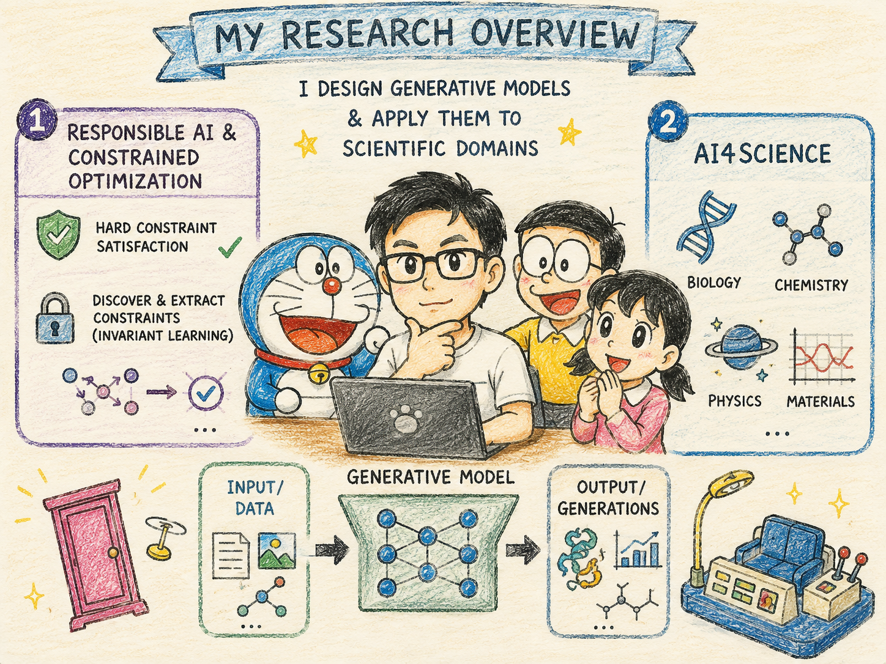

# About Me

Greetings!

I'm a Ph.D. student in Computer Science at the University of Virginia, advised by [Prof. Ferdinando Fioretto](https://nandofioretto.github.io/) as part of the **Responsible AI for Science and Engineering (RAISE)** group. Previously, I earned my BSc in Mathematics from Beloit College.

# Research

I design safe generative models and apply them to scientific domains. My research is distributed across three main directions:

* **Responsible AI & Constrained Optimization:** I study how to guarantee hard constraint satisfaction within generative architectures. I am also interested in exploring how we can automatically discover and extract these underlying constraints/rules from data using invariant learning.
* **AI4Science:** I am driven to solve scientific problems in bio-modelling, computational medicine, and agent trajectory / control.

I look forward to connecting with researchers working in the same direction.

# News

- **[Aug. 2026]** Starting my Ph.D. in Computer Science at the University of Virginia as part of the RAISE group!

# Publications

Please view my [Google Scholar](https://scholar.google.com/citations?user=v3_DrtcAAAAJ&hl=en) profile for the latest updates.
